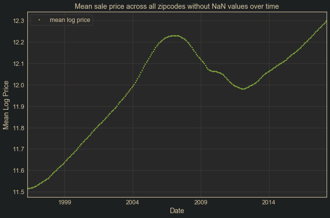
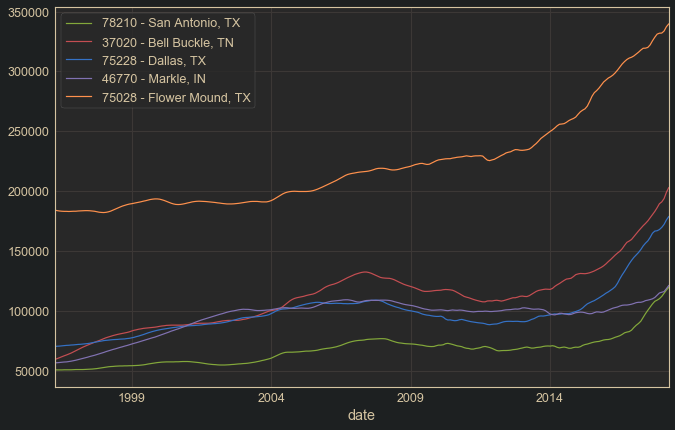
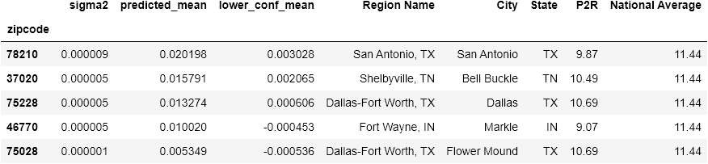
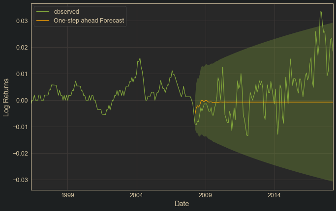
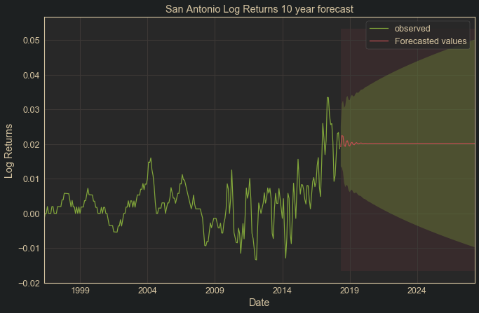
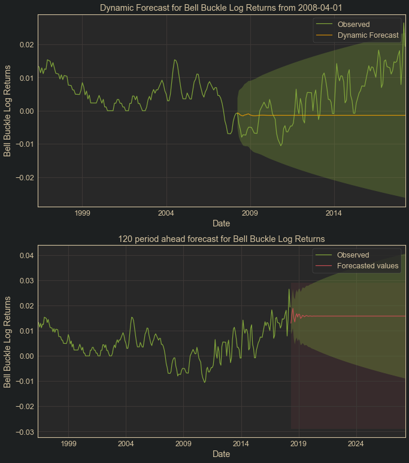
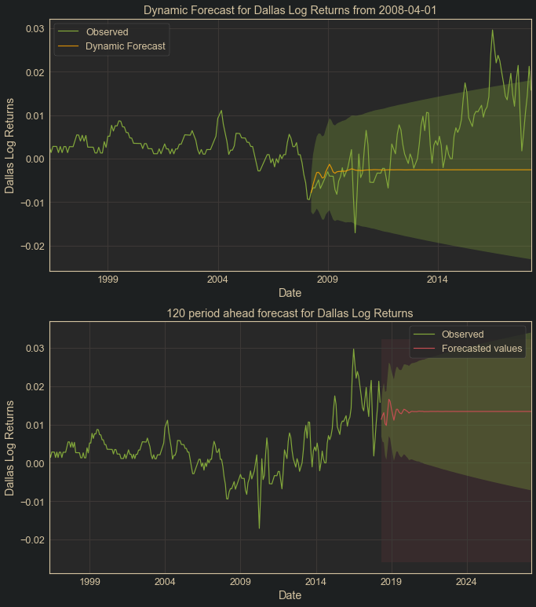
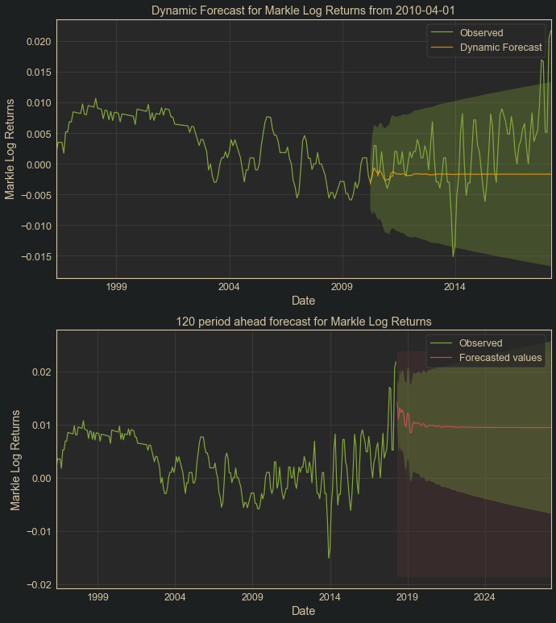
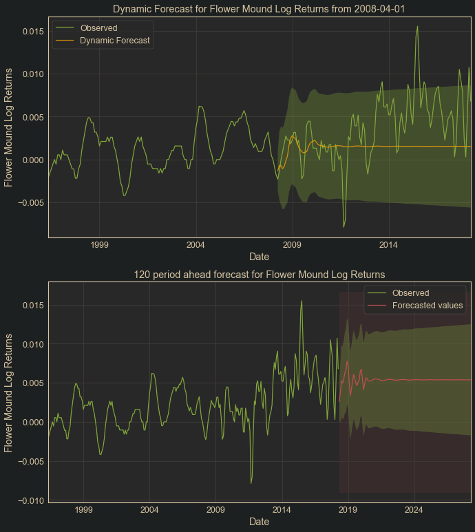
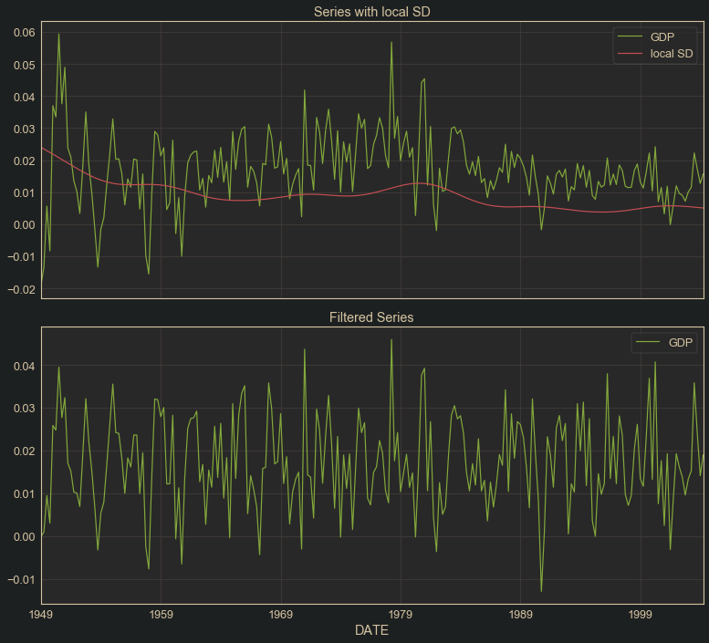

.

# Real Estate Consulting using Time Series Analysis

In this study, housing data from Zillow was analyzed using time series analysis in order to consult an imaginary real estate investment firm on the top 5 US zip codes for investment. First, research was conducted in the field of real estate consulting in order to gain domain understanding for the task. Next, an analytical approach was used to find the best 5 contending zip codes for investment of the 14,723 present in the data set. The abilities of SARIMAX models to explain and forecast the data were investigated extensively, using a variety of approaches including the addition of fourier series and heteroscedasticity filtering. A method was devised to call R functions from within a Python workflow in order to quickly generate appropriate SARIMAX model orders and coefficients for a given time series so that each zip code could be modeled individually. Results of this modeling process were then used to select the most promising contenders for investment based on a combination of high anticipated growth and low expected volatility.

In order to complete this project, it was necessary to do exploration in R as well as Python, and to find ways to call R functions in the python work flow using rpy2. Time series analysis packages in both languages were explored in depth to maximize the ability to explain the data with time series modeling. A supplemental research project was conducted on heteroscedasticity filtering in an attempt to increase the efficiency of coefficient estimates by recreating [a 2007 study by Stockhammar & Oller](https://www.researchgate.net/publication/232972313_A_Simple_Heteroscedasticity_Removing_Filter). The US GDP data used in their study was obtained from the [Bureau of Economic Analysis website](https://www.bea.gov/), and a [notebook](research_notebooks/recreating_Stockhammar&Oller_2007.ipynb) is dedicated to replicating the workflow demonstrated in the paper. Although the heteroscedasticity filter proposed in their study was successfully recreated, it did not prove useful in aiding the modeling of the real estate data used for this study. The use of fourier series as exogenous variables in SARIMAX models was explored. Helpful functions for time series analysis, spectral analysis and fourier series generation, as well as the heteroscedasticity filtering were created and stored in a text file for convenient use.

Below, we can see the movement of the housing market as a whole over the period of study. Note the period of decline around the 2007-2008 housing market crash, which causes the heteroscedasticity in the return streams: 

Zip codes were selected based on high expected growth rate and low expected volatility over a period of 10 years. A 10 year forecasting period was chosen because this was around the average period of time which the investor could pay off the cost of ownership of a property by renting it. The SARIMAX models fitted to each zip code produced information which could be used to compare zip codes along these lines. The sigma squared of the models could be used to compare expected volatility, the mean expected return could be used to compare expected growth, and the lower confidence level of returns could be used to represent both.

Price-to-rent ratio was also considered in selecting the top zip codes for investment, which indicate the average number of years of rent payments needed to pay off the cost of ownership for a property in a given area. The national average at the time of the study was 11.44, so zip codes were selected which were near or below this level. Care was also taken to not select zip codes which were extremely close together, in order to avoid position concentration risk. For more detailed explanation of the analytical process used to select the top zip codes for investment, 

The sales price history of the selected top 5 zip codes for investment, as well as the correpsonding features by which they were selected, are below: 
 

Visualizations of the predictions given by the models fit to the selected top 5 zip codes are seen here, note the high expected return and narrow confidence intervals for these zip codes: 

San Antonio, TX: 
 
 

Bell Buckle, TN: 
 

Dallas, TX: 
 

Markle, IN: 
 

Flower Mound, TX: 
 

A graphic depicting the S&O heteroscedasticity filter on the US GDP data is below: 

## Folders
 - data : contains all csv files used in the project.
 - functions : contains all text files containing functions created for the project.
 - images : all image files generated for use in blog post and readme.
 - primary_notebooks : contains the main python and R notebooks of the project
 - research_notebooks : contains all python and R notebooks created in the research process.

## Notebooks
#### Primary Notebooks:
 - intro_and_data_understanding.ipynb : This notebook contains the domain research, data understanding and preparation, as well as the analysis to find the top 5 performing zip codes in the data.
 - modeling_whole_market.ipynb : This notebook contains all modeling of the combined market data using python using statsmodels' SARIMAX and Facebook Prophet.
 - modeling_zip_codes.ipynb : Contains all work related to modeling individual zip codes and comparing models to find best investment candidates.
 - ARIMA-GARCH_modeling_in_R.ipynb : This notebook contains ARIMA-GARCH modeling of the market data done with R using the forecast and rugarch packages.
 - ARIMA-GARCH_zip_w_heavy_losses.ipynb : This is a duplicate of the above notebook in which the workflow is repeated to focus on a single zip code which saw heavy losses during the market crash, in order to see if there was anything remarkable about the conditional volatility at that time.
#### Research Notebooks
 - recreating_Stockhammar&Oller_2007.ipynb : This notebook imports the GDP data used by Stockhammar & Oller in their 2007 paper "A Simple Heteroscedasticity Removing Filter" and recreates their workflow in python.
 - understanding_fourier_series_with_R.ipynb : An exploration in R of fourier series.
 - Housing-Price-Dynamics notebook.ipynb : Project notebook which was eventually divided into the notebooks above due to size.
 - full_research.ipynb : Original unedited project file
 - ARIMA-GARCH_modeling_medians_in_R.ipynb : A duplicate of the R modeling notebook which compared the performance of the models on the median prices across zipcodes.
